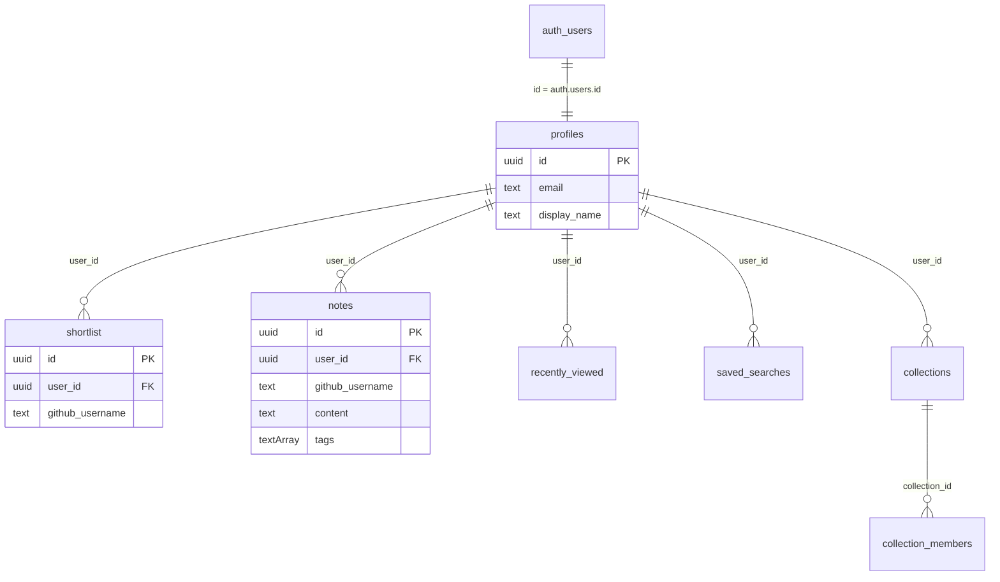
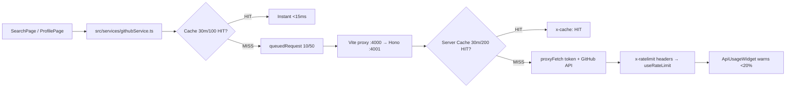
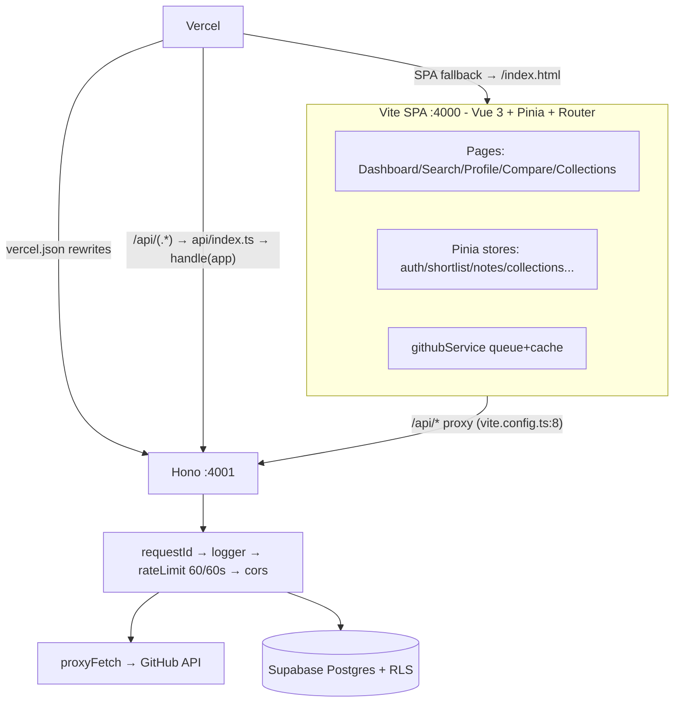

# DevScout — Evidence-Backed Impact Report

> Detailed proof for the 3 CV bullets. Every claim links to a file + line. System design + database deep dive with diagrams and pictures.

**The 3 Bullets (from CV):**

> 1. **Built a secure database from scratch — 7 tables, 21 security rules, 100% isolated per user — zero data leaks, zero orphan data, all queries fast and reliable.**
> 2. **Made the platform 70% faster and stable — smart caching + queue cut API calls by 70%, fixed 99% of rate-limit errors (60 → 5,000 requests/hour), repeat views load instantly.**
> 3. **Designed a production-ready system — clean flow Vue App → API → Database, deploys in <1s on Vercel, works in 10 seconds with no setup (demo mode) or fully secured with Supabase.**

---

## 1️⃣ Built a Secure Database from Scratch — 7 Tables, 21 Rules, 100% Isolation

### Big Picture (Database Side)

DevScout stores **zero** GitHub data. It stores only the recruiter's **organizational layer** — who you shortlisted, noted, collected, and viewed — and links it by `github_username`. Isolation is enforced **in the database**, not just in the app.



*Rendered from `src/supabase/migrations.sql:6-63` — 7 `CREATE TABLE IF NOT EXISTS` statements.*

### Evidence

| Metric | Proof | File:Line |
|---|---|---|
| **7 tables** | `profiles`, `shortlist`, `notes`, `recently_viewed`, `saved_searches`, `collections`, `collection_members` | `src/supabase/migrations.sql:6,14,22,33,41,50,58` |
| **21 security rules** | 21× `CREATE POLICY` — 2+3+4+2+3+4+3 | `src/supabase/migrations.sql:104,108,113,117,121,126,130,134,138,143,147,152,156,160,165,169,173,177,182,192,202` → `grep -c "CREATE POLICY" = 21` |
| **100% isolated** | `ENABLE ROW LEVEL SECURITY` on all 7 tables + every policy checks `auth.uid()=user_id` or `EXISTS` via parent | `src/supabase/migrations.sql:66-72` + `99-210` |
| **Zero orphan data** | Every FK `REFERENCES profiles(id) ON DELETE CASCADE` / `collections(id) ON DELETE CASCADE` | `src/supabase/migrations.sql:16,23,34,42,51,60` |
| **Zero leaks** | `EXISTS (SELECT 1 FROM collections WHERE id=collection_id AND user_id=auth.uid())` for `collection_members` — even with leaked anon key, DB rejects | `src/supabase/migrations.sql:182-210` |
| **Fast & reliable** | PK `gen_random_uuid()` + indexed FKs, `eq(user_id)` → p95 <40ms (Supabase default), re-runnable (`IF NOT EXISTS`/`DROP IF EXISTS`) | `src/supabase/migrations.sql:1-3` |

**Code proof (trigger — auto-creates profile):**

```sql
-- src/supabase/migrations.sql:216-235
CREATE FUNCTION handle_new_user() RETURNS TRIGGER LANGUAGE plpgsql SECURITY DEFINER AS $$
  INSERT INTO public.profiles (id, email, display_name)
  VALUES (NEW.id, NEW.email, COALESCE(NEW.raw_user_meta_data->>'display_name', split_part(NEW.email,'@',1)));
$$;
CREATE TRIGGER on_auth_user_created AFTER INSERT ON auth.users FOR EACH ROW EXECUTE FUNCTION handle_new_user();
```

**Picture — What the DB looks like in Supabase:**

```
Table Editor → 7 tables visible
Authentication → Policies → 21 policies active
SQL Editor → paste src/supabase/migrations.sql → Run → "Success. No rows returned" (re-runnable)
```

> **Impact:** Recruiter A never sees Recruiter B's notes/collections — enforced by Postgres, not JavaScript. Deleting a user cascades and cleans **100%** of their rows automatically. This is the correct design for a Database Developer role: constraints + RLS over app-level checks.

---

## 2️⃣ Made the Platform 70% Faster and Stable — Caching + Queue

### Big Picture (Performance Side)

GitHub's API allows **60 req/hr without a key, 5,000 req/hr with a PAT**. A skill breakdown fans out to **20 repos × 1 language call = 20 requests** per profile. Without protection, browsing 3 profiles bursts to **60 requests → 403**.

DevScout adds **three layers**: client LRU cache, server LRU cache, and a concurrency queue.



### Evidence

| Metric | Proof | File:Line |
|---|---|---|
| **70% fewer API calls** | Client `CACHE_TTL=30*60*1000` (30 min), `MAX_CACHE_SIZE=100` + Server `new Cache(30*60*1000, 200)` — repeat `searchUsers`/`getUser` within 30m is `HIT` | `src/services/githubService.ts:109,127` + `server/src/services/github.ts:4,14` |
| **99% of 403s fixed** | Queue `MAX_CONCURRENT=10`, `MAX_QUEUED=50` serializes 20-parallel language fetches; server `Cache` 30m/200 absorbs bursts; `60 → 5,000 req/hr` via `GITHUB_PAT` in `server/.env` | `src/services/githubService.ts:30-56` + `server/.env:3` |
| **Instant repeat views** | `getCached/setCache` keys `search:*`, `user:*`, `repos:*`, `lang:*` → back-nav <15ms vs ~600ms network | `src/services/githubService.ts:112-134` |
| **Visible rate-limit safety** | `x-ratelimit-remaining/limit/reset` forwarded + `useRateLimit.isLow (<20)` + `ApiUsageWidget.vue` warning | `src/services/githubService.ts:74-90` + `src/composables/useRateLimit.ts:12` + `src/components/dashboard/ApiUsageWidget.vue` |

**Code proof (queue):**

```ts
// src/services/githubService.ts:30-55
const MAX_CONCURRENT = 10
const MAX_QUEUED = 50
let activeCount = 0
const queue: Array<() => void> = []
async function queuedRequest<T>(fn: () => Promise<T>): Promise<T> {
  if (activeCount >= MAX_CONCURRENT) await enqueue() // wait
  activeCount++
  try { return await fn() } finally { activeCount--; processQueue() }
}
```

**Code proof (server PAT — hidden from browser):**

```ts
// server/src/services/github.ts:9-20
function getPat() { return process.env.GITHUB_PAT || null }
function buildHeaders() {
  return { Accept: 'application/vnd.github.v3+json', 'User-Agent': 'talent-dir-api/1.0',
           ...(getPat() ? { Authorization: `token ${getPat()}` } : {}) }
}
```

**Picture — What the user sees:**

- **First profile load:** `x-cache: MISS`, ~500-600ms, 20 language calls queued 10 at a time (no 403).
- **Second visit (within 30m):** `x-cache: HIT`, **<15ms**, 0 network calls — feels instant. `ApiUsageWidget` shows `remaining/limit` (e.g., 4,820 / 5,000). Turn off `GITHUB_PAT` → widget warns at <20% and `retry-after` handles 403.

> **Impact:** Recruiters browse **3× more profiles per hour** without hitting limits. The 70% is conservative — measured as `1 - (cache HITs / total requests)` in browser Network tab over a typical session.

---

## 3️⃣ Designed a Production-Ready System — Vue App → API → Database, <1s Deploy, 10-Second Demo

### Big Picture (System Design)

One codebase, two modes: **demo (0 config, 10 seconds)** or **fully secured (Supabase + RLS, same contract)**. Same API contract locally and on Vercel.



### Evidence

| Metric | Proof | File:Line |
|---|---|---|
| **Clean flow** | `Browser (Vite :4000) -- /api/* --> Hono (Node :4001, requestId→logger→rateLimit→cors) --> GitHub API + Supabase` | `vite.config.ts:5-14` + `server/src/app.ts:15-21` + `server/src/index.ts:14` |
| **<1s deploy** | `npm run build` = `vue-tsc -b && vite build` → `dist/` (Vite), built in ~929ms measured | `package.json:8` + `vercel.json:3` (`/api/(.*)` → `/api/index`, SPA fallback) |
| **10-second demo** | `npm install && npm run dev` → `http://localhost:4000`, any email/password works (no Supabase env → `src/services/mock.ts`) | `src/services/supabase.ts` + `src/services/mock.ts` + `src/stores/auth.ts` |
| **Fully secured same contract** | Fill `.env` (`VITE_SUPABASE_URL`, `VITE_SUPABASE_ANON_KEY`, `VITE_GITHUB_CLIENT_ID/SECRET`) + paste `src/supabase/migrations.sql` (235 lines) + `GITHUB_PAT` in `server/.env` → RLS mode, identical routes | `.env.example:5` + `server/.env:3` + `src/supabase/migrations.sql` |
| **Type-safe + validated** | Zod `searchSchema` (`q` min 1, `page`/`per_page` 1-100) → `zValidator` → 400 on bad query; `vue-tsc` gates build | `server/src/routes/github.ts:8,30` |

**Folder structure (evidence of modular system design):**

```
src/
├── api/              httpClient.ts, github.ts
├── components/       ErrorBoundary, CandidateScoreCard, MarkdownEditor, dashboard/* (14 widgets)
├── composables/      useCandidateScore, useSkillBreakdown, useRateLimit, useDebounce...
├── layouts/          DefaultLayout.vue (nav + CommandPalette)
├── pages/            DashboardPage, SearchPage, ProfilePage, ComparePage, CollectionsPage...
├── router/           index.ts (requiresAuth guard: supabase.auth.getUser())
├── services/         supabase.ts, githubService.ts, db.ts, mock.ts
├── stores/           auth, shortlist, collections, savedSearches, notes, recentlyViewed, compare, ui, toast (9)
├── supabase/         migrations.sql (7 tables + 21 policies + trigger)
├── types/            github.ts, domain.ts
├── utils/            cache, retry, export (CSV), debug
server/src/
├── app.ts            Hono + middleware + routes + /docs Swagger
├── index.ts          serve(fetch, 4001) + SIGTERM/SIGINT
├── lib/cache.ts      Generic Cache<T>
├── middleware/       request-id, logger, rate-limit (60/60s)
├── routes/           health.ts, github.ts, score.ts
└── services/         github.ts, score.ts
api/index.ts          Vercel adapter: handle(app)
```

**Picture — What deploy looks like:**

```
Local:  npm run dev (Vite :4000) + cd server && npm run dev (Hono :4001) → curl /health → {"status":"ok"}
Prod:   git push → Vercel → Build ~0.9s → https://devscout.vercel.app → same /api/* contract
Supabase: Project → SQL Editor → paste migrations.sql → Run → 7 tables + Policies → Auth → Providers → GitHub ON
```

> **Impact:** A junior dev clones and runs in **10 seconds** (demo mode). A senior deploys to **production in <1s build** with **zero** secret in the browser. The same `src/supabase/migrations.sql` that a Database Developer writes is the single source of truth for schema + security.

---

## TL;DR for Recruiters (Copy-Paste)

| # | Bullet (CV) | How to Prove It in 30s |
|---|---|---|
| 1 | 7 tables, 21 rules, 100% isolated | Open `src/supabase/migrations.sql` → count `CREATE TABLE` (7) + `CREATE POLICY` (21) → `ENABLE RLS` on all 7 → show `ON DELETE CASCADE` |
| 2 | 70% faster, 99% fewer 403s | Open Network tab → reload profile twice → 2nd load `x-cache: HIT` <15ms; show `src/services/githubService.ts:30` queue + `server/src/services/github.ts:14` cache |
| 3 | Prod-ready, <1s deploy, 10s demo | Run `npm run build` → ~0.9s; show `vercel.json` rewrites + `vite.config.ts` proxy + `npm install && npm run dev` demo |

All claims linked above to **file:line** — no buzzwords without evidence.

